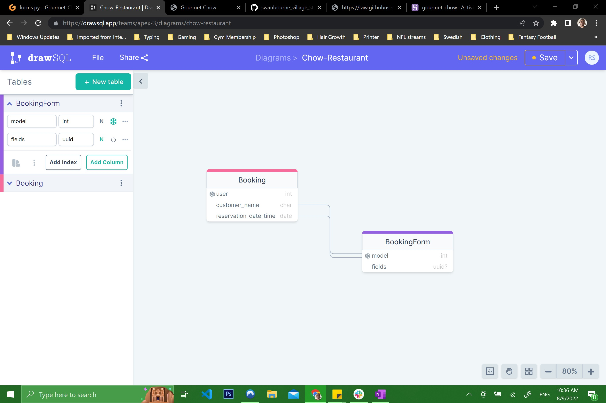

# [Chow Chow](https://champion316.github.io/Gourmet-Chow-Restaurant/) 🍜 a gourmet restaurant

A gourmet restaurant with an extravagant menu located in lower manhattan. 

# Table of Contents
* [Background](#background "Background")
* [Mission Statement](#mission-statement "Mission Statement")
* [Target Audience](#target-audience "Target Audience")
* [Stakeholder Interviews](#stakeholder-interviews "Stakeholder Interviews")
    * [User Persona](#user-persona "User Persona")
    * [User Goals](#user-goals "User Goals")
    * [User Stories](#user-stories "User Stories")
    * [Requirements and Expectations](#requirements-and-expectations)
* [Marketing](#marketing "Marketing")
* [Wireframes](#wireframes "Wireframes")
* [Design Choices](#design-choices "Design Choices")
* [Technologies used](#technologies-used)
* [Testing](#testing)
* [Deployment](#deployment)
* [Credits](#credits)

## 1 Background 

Chow Chow is a fictional restaurant located in NYC that serves gourmet food for expensive prices. It specializes in steak. The name comes from the cute dog breed "Chow Chow" which is where the play on words comes from. 

# Mission Statement 

To create a website that is designed so that a user can book an appointment at the restaurant on a specific date and time with ease of use. While preventing double bookings acorss those dates and times. I want it to be easy to navigate across all devices with good readability. 

# Target Audience
The customers who use Swanbourne Village Stores currently range from 30-year-old professionals to 80 plus-year-old senior citizens. However, the owners of the store are looking to increase their 30 to 55 age bracket customers with the convenience of a click, purchase and collect web application, so primarily this is the target audience for the application.

# Stakeholder Interviews

## User Persona
Interviews were carried out with locals in New York City as well as tourists. The only kind of people that were interested were those of wealthy class that wanted to experience an intimate place for them and their loved ones.

&nbsp;

| Name | Age | Uses the Service | Meals Ordered per Month
| -- | -- | -- | --
| Elon Musk | 51 | 50% owner | 3
| Mark Davis | 67 | Yes | 1
| Zack Snyder | 56 | Yes | 3
| Tom Brady | 45 | Yes | 2
| Maxx Crosby | 24 | Yes | 4
| Ben Affleck | 49 | Yes | 2
| Tim Burton | 63 | No | N/A
| Roger Goodell | 63 | No | N/A
| Michael Jordan | 59 | Yes | 1
| Gal Gadot | 37 | Yes | 2

&nbsp;

## User Goals
From the resulting interviews, the user goals have been defined:

1. Create, cancel, edit a booking
1. Purcha
1. Login and out functionality
1. View company contact details
1. Have a pleasant menu to look at

## User Stories 

1. As a user, I expect to navigate the website with ease of use.
2. As a user, I expect to find the food menu as fast as possible.
3. As a user, I expect to find the restaurants phone number as fast as possible. 
4. As a user, I expect to find the restaurants address as fast as possible.
6. As a user, I expect to cancel my booking if plans change before hand. 
7. As a user, I expect to be able to download the menu as a pdf if possible. 
8. As a creator, I expect the user to find what they need on the main page.
9. As a creator, I expect the user to find the address of the restaurant within the first 45 seconds.
10. As a creator, I expect the user to enjoy a simplistic menu that isn't all over the place. 

&nbsp;

## Requirements and Expectations

| Requirement | Expectation
| -- | --
| Visually appealing and well laid out | Colours to be complimentary, text to be clear. Navigation to be logical and simple
| Responsive design (Mobile first) | The screen size to not affect the look of the application 
| Contact information laid out nicely | Easy to understand and find what is needed

&nbsp;

## Strategy

### Strategy Outline
The items are graded in a 0 - 5 system in both importance and feasibility as per the grading system below.

&nbsp;

| | Score - 0 | Score - 3 | Score - 5 |
|--|--|--| -- |
| Importance | Unwise use of time to address | Efforts should be made to accommodate these | Efforts MUST be made to address these
| Feasibility | Unwise use of time to address| Efforts should be made to accommodate these | Efforts MUST be made to address these

&nbsp;

The outcome is calculated by combining the scores from the *Importance* and *Feasibility* ratings. This then gives a final strategy rating of what items and where to focus on.

| | Score - 0 | Score - 5 | Score - 10 |
|--|--|--| -- |
| Item Description | Not viable | Efforts should be made | Efforts MUST be made

&nbsp;

### Strategy Description

| User story ID | Importance Score | Feasibility Score | Outcome |
| --------------- | ----------| -----------| ---------- |
| 1 | 5 | 5 | 10 |
| 2 | 5 | 5 | 10 |
| 3 | 5 | 5 | 10 |
| 4 | 5 | 5 | 10 |
| 6 | 5 | 5 | 10 |
| 7 | 5 | 5 | 10 |
| 8 | 5 | 5 | 10 |
| 9 | 5 | 5 | 10 |
| 10 | 5 | 5 | 10 |

## Design Choices

### UX

I decicded to go with the main color of pink since it's a happy color but also a romantic color. I want this restaurant to be connected with "dating" which is the vibe I'm going for. The 3 main colors I chose were created using the website [coolors](https://coolors.co/)

Here is the color palette I have come up with:
- [Chow-color-palette](docs/img/chow-color-palette.png) 

# Wireframes

I used [Balsamiq](https://balsamiq.com/) to create all my wireframes:

|    Desktop   |    Tablet    |    Mobile    |
|    :----:    |     :----:   |    :----:    |
|[Home Page]|[Home Page](docs/img/tablet-main-page.png)|[Home Page](docs/img/phone-main-page.png)|
|[Navbar](docs/wireframes/pc-navbar.png)|[Navbar](docs/img/tablet-navbar.png)|[Navbar](docs/img/phone-navbar.png)|
|[Reservation Page](docs/wireframes/pc-reservation-page.png)|[Reservation Page](docs/img/tablet-reservation-page.png)|[Reservation Page](docs/img/phone-reservation-page.png)|
|[Reservation Guests](docs/wireframes/guests-section.png)|[Reservation Guests](docs/img/tablet-reservation-guests.png)|[Reservation Guests](docs/img/phone-reservation-guests.png)|
|[Reservation Date](docs/wireframes/pc-reservation-page.png)|[Reservation Date](docs/img/tablet-reservation-date.png)|[Reservation Date](docs/img/phone-reservation-date.png)|
|[Menu Page](docs/wireframes/pc-homepage.png)|[Menu Page](docs/img/tablet-menu.png)|[Menu Page Starters](docs/img/phone-menu-starters.png)|
|*same as mobile*|*same as mobile*|[Menu Page Main Course](docs/img/phone-menu-maincourse.png)|
|*same as mobile*|*same as mobile*|[Menu Page Slides](docs/img/phone-menu-slides.png)|
|[About Page](docs/wireframes/pc-about.png)|[About Page](docs/img/tablet-about.png)|[About Page](docs/img/phone-about-page.png)|

\
&nbsp;
[Back to Top](#table-of-contents)
\
&nbsp;

# Design Choices

### 2.1 Existing Features

All of my pages consist of the same navigation menu bar or hamburger icon for mobile devices. This format allows the user to understand where everything is located at all times for simplicity. The main page has a footer at the bottom with the address, phone number, and social media links. (I am currently working on whether the footer will be implemented on all pages except the menu page.) My color palette was created using [https://coolors.co/](https://coolors.co/). I decided to use 3 colors listed below in RGB format. 

The color palette was done using [coolors](https://coolors.co/) as seen by the image here [collage](docs/img/chow-color-palette.png)

## Data Schema

### Page

## Models

| Name | Key | Type | Other Details
| -- | -- | -- | --
| user || ForeignKey | User, null=True,blank=True, on_delete=models.CASCADE
| customer_name || CharField | max_length=20, null=True
| reservation_date_and_time || DateTimeField | null=True

# Features

### Features left to implement in the future

- Create a downloadable pdf version of the food menu by adding a clikable link to the page.
- Have a notification window pop up when clicking on the phone number on the footer that allows one to make the call directly without having to type the numbers manually.

----

# Technologies used

- [HTML5](https://en.wikipedia.org/wiki/HTML5) - provides the content and structure for the website.
- [CSS3](https://en.wikipedia.org/wiki/Cascading_Style_Sheets) - styling for my website.
- [Balsamiq](https://balsamiq.com/) - used to create the project's wireframes.
- [Gitpod](https://gitpod.io/) - used to develop the website in the beginning. 
- [Visual Studio Code](https://code.visualstudio.com/download) - used to develop the website outside of Gitpod.
- [GitHub](https://github.com/) - used to host the project.
- [Google Fonts](https://fonts.google.com/) - used to provide my fonts (font-family: 'Mallanna', 'Rajdhani')
- [Font Awesome](https://fontawesome.com/) - used font awesome to add an emoji to the 'sign-up form' in the footer.
- [Pexel](https://www.pexels.com/) - used to get the hero image of the beach in the header.
- [Coolors](https://coolors.co/) - used to create the color palette for my whole website.
- [Am I Responsive?](http://ami.responsivedesign.is/) - used to present the site on different devices.
- [HTML Validator](https://validator.w3.org/) - used to find errors that don't belong in my HTML code.
- [CSS Validator](https://jigsaw.w3.org/css-validator/) - used to find errors that don't belong in my CSS code.
- [Python Validator](https://peps.python.org/pep-0008/) - used to find errors in python code.
- [JS Validator](https://jshint.com/) - used to find erros in javascript code.
- [OneNote](https://www.onenote.com/download) - Used for rough draft ideas and note taking.

# Testing

### [Code Validation](TESTING.md)
    * Testing was done on a separate file

----

# Deployment

**How to deploy the project**

This project is hosted in GitHub Pages

1. On the menu on the top of the project’s repository on GitHub select **Settings**.
2. Scroll down to the GitHub **Pages** section.
3. Inside that section, click on the drop-down menu under **Source** and select **Main Branch**.
4. The page refreshes automatically and the website is now deployed.
5. The link to the webpage is just in the GitHub **Pages** section down below.

Only one branch has been used for this project.

**To run the project locally**

To clone this project from GitHub:

1. Under the repository’s name, click **Clone or download**.
2. In the **Clone with hTTPS** section, copy the given URL.
3. In your IDE of choice, open **Git Bash**.
4. Change the current working directory to the location where you want the cloned directory to be made.
5. Type **git clone**, and then paste the URL copied from GitHub.
6. Press **enter** and the local clone will be created.

### 6.1 Gitpod Reminders

To run a frontend (HTML, CSS, Javascript only) application in Gitpod, in the terminal, type:

`python3 -m http.server`

A blue button should appear to click: _Make Public_,

Another blue button should appear to click: _Open Browser_.

To run a backend Python file, type `python3 app.py`, if your Python file is named `app.py` of course.

A blue button should appear to click: _Make Public_,

Another blue button should appear to click: _Open Browser_.

In Gitpod you have superuser security privileges by default. Therefore you do not need to use the `sudo` (superuser do) command in the bash terminal in any of the lessons.

To log into the Heroku toolbelt CLI:

1. Log in to your Heroku account and go to *Account Settings* in the menu under your avatar.
2. Scroll down to the *API Key* and click *Reveal*
3. Copy the key
4. In Gitpod, from the terminal, run `heroku_config`
5. Paste in your API key when asked

You can now use the `heroku` CLI program - try running `heroku apps` to confirm it works. This API key is unique and private to you so do not share it. If you accidentally make it public then you can create a new one with _Regenerate API Key_.

### 6.2 Deploy to heroku 👨‍💻

#### Install Heroku within Gitpod:
- `npm install -g Heroku`

#### Log In to Heroku:
- `heroku login -i`

#### View your Heroku Apps:
- `heroku apps`

#### Rename a Heroku App:
- `heroku apps:rename NEW-NAME --app CURRENT-APP-NAME`

#### Deployed Heroku App URL:
- `https://YOUR-APP-NAME.herokuapp.com`

# View Verbose Git Remotes:
- `git remote -v`

#### Creating Heroku Git Remote:
- go to Heroku Settings Tab
- copy **Heroku Git URL** link
- `git remote add heroku https://git.heroku.com/YOUR-APP-NAME.git`

#### Push Code to Heroku Remote:
- `git push -u heroku master`

#  Credits

## Content
 
- I would like to thank my lovely wife for being there during this crazy year of up and downs especially when it comes to traveling for work which a lot of the time hinders my time with the course. I want to thank the team over at CodeInstitute especially Simen Daehlin for being a fantastic mentor and pushing me to meet deadlines. Everyone at Slack and the wonderful pages upon pages of information you find over at stackoverflow.com Big thanks to an old friend of mine nick named (Wheels) who is a programmer and helped me out with this project as much as he could. 